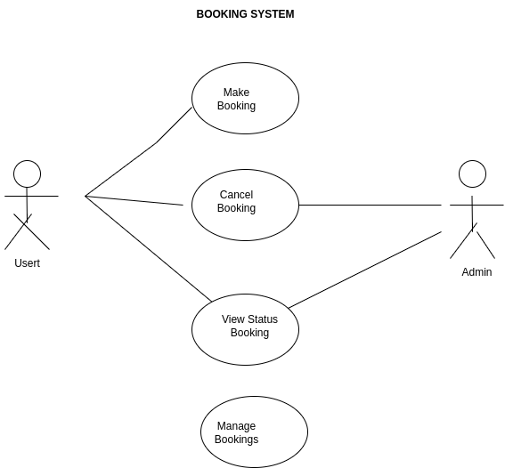

# Requirement Analysis in Software Development
This repository provides a comprehensive overview of the Requirement Analysis phase in the Software Development Life Cycle (SDLC). It includes explanations, examples, and visual aids to understand and document software requirements effectively.
## What is Requirement Analysis?
Requirement Analysis is the process of identifying, gathering, and documenting the functional and non-functional needs of a software system. It involves communication with stakeholders, analysis of user needs, and transforming them into formal documentation.
It plays a critical role in the Software Development Life Cycle (SDLC) as it ensures the development team understands what needs to be built, reducing the risk of rework and project failure.
## Why is Requirement Analysis Important?
Improves Clarity and Understanding**: Ensures all stakeholders have a shared understanding of the system requirements.
Reduces Rework**: Early clarification of requirements helps minimize costly changes during later development phases.
Enhances Planning**: Accurate requirements enable better project planning, estimation, and risk management.
## Key Activities in Requirement Analysis
Requirement Gathering**: Collecting requirements from stakeholders using interviews, surveys, or observations.
  Requirement Elicitation**: Clarifying and refining the collected requirements to ensure completeness.
  Requirement Documentation**: Recording requirements in a structured format such as BRDs, user stories, or use cases.
  Requirement Analysis and Modeling**: Analyzing requirements for feasibility and modeling them using diagrams.
  Requirement Validation**: Ensuring the documented requirements match user expectations and business needs.
## Types of Requirements

### Functional Requirements
These define the specific behaviors, functions, and features of the system.

**Examples for the Booking Management System:**
- Users can book a service online.
- Admin can approve or cancel a booking.
- System sends confirmation emails after a booking.

### Non-functional Requirements
These describe how the system performs under certain conditions.

**Examples:**
- The system should be available 99.9% of the time.
- Pages must load within 2 seconds.
- The system must support up to 10,000 concurrent users.
## Use Case Diagrams

Use Case Diagrams visually represent the interactions between users (actors) and the system. They help stakeholders understand the system scope and functionality quickly.

